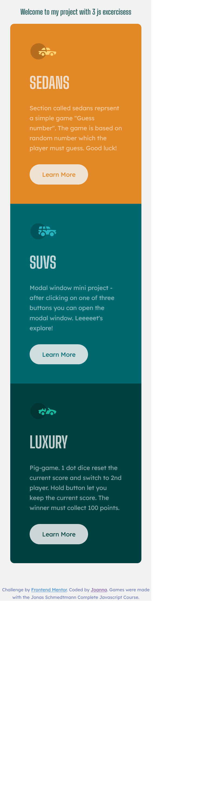
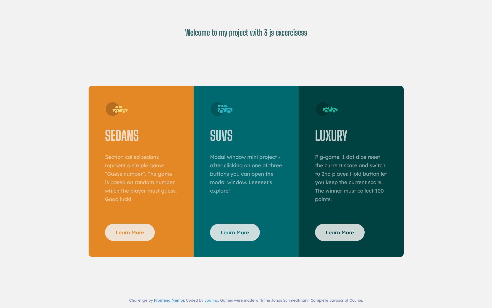
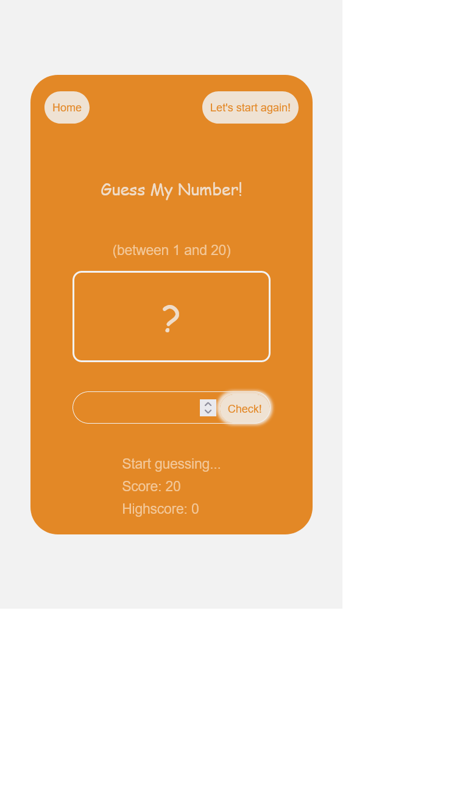
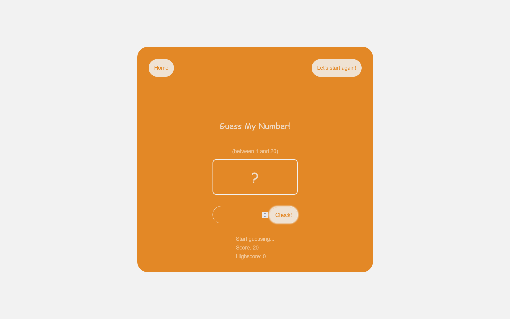
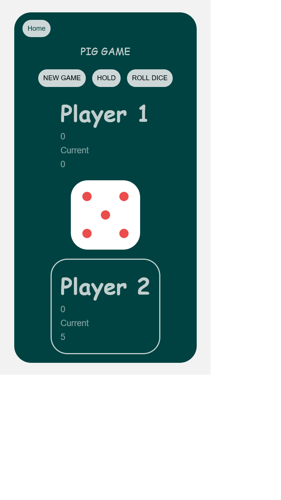
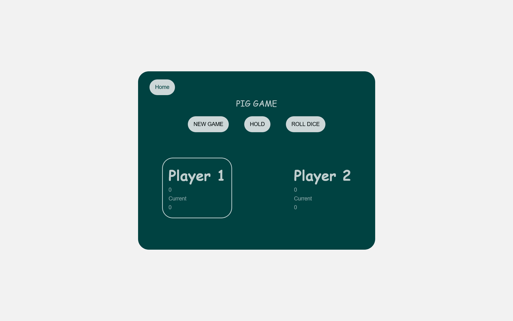

# Frontend Mentor - 3-column preview card component solution

This is a solution to the [3-column preview card component challenge on Frontend Mentor](https://www.frontendmentor.io/challenges/3column-preview-card-component-pH92eAR2-). Frontend Mentor challenges help you improve your coding skills by building realistic projects. 

## Table of contents

- [Overview](#overview)
  - [The challenge](#the-challenge)
  - [Screenshot](#screenshot)
  - [Links](#links)
- [My process](#my-process)
  - [Built with](#built-with)
  - [What I learned](#what-i-learned)
  - [Continued development](#continued-development)
  - [Useful resources](#useful-resources)
- [Author](#author)

## Overview

### The challenge

Users should be able to:

- View the optimal layout depending on their device's screen size
- See hover states for interactive elements

- Guess number: 
* see the communicate if the given number between 1 and 20 is equal the random number given by the game 
* see how many attemps are still available if the given number is wrong 
* reset the game

- Modal window:
* after clicking the button see the modal window

- Pig game:
* see the actual score of both players
* see the number of dice after clicking on roll dice
* when the dice number is equal 1 the game should be switched to the second player
* when the player aim 100 points, he wins 
* after clicking on new game button the game should be reset
### Screenshots

### Links

- [Solution URL:](https://github.com/JoannaLapa/3-column-card-component-with-simple-js-excercises)
- [Live Site URL:]( https://joannalapa.github.io/3-column-card-component-with-simple-js-excercises/)

## My process

### Built with

- CSS Grid
- Mobile-first workflow
- Gulp
- SCSS
### What I learned

In this project I priced clamp() function to avoid media queries corrections. I prepared 3 simple JS functionalities continiuing complete JavaScript course with Joans Schmedtmann. I adapted them to the design prapared by frontendmentor stuff.

### Continued development

As I still learn JavaScript this is my aim on future project. As I would feel very comfortable with JS I plan to learn React or Vue framework.

### Useful resources

- [Jonas Schmedtmann course](https://www.udemy.com/share/101Wfe3@bVoG0t5AUjzOgUGl3d6m8sieo2oiiLeO7FV1s-hJAGXS6rGHEW9yLAtpUON-joVoXg==/) - I continue this complex JS course 

## Author

- Frontend Mentor - [@JoannaLapa](https://www.frontendmentor.io/profile/JoannaLapa)
- Github - [@JoannaLapa] - (https://github.com/JoannaLapa)
